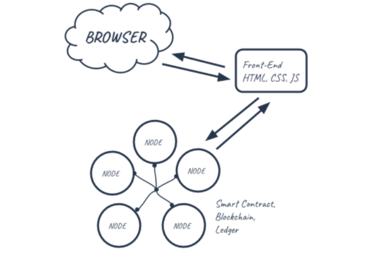
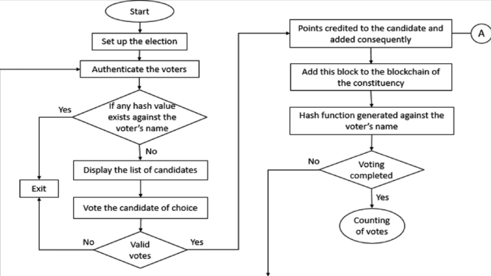
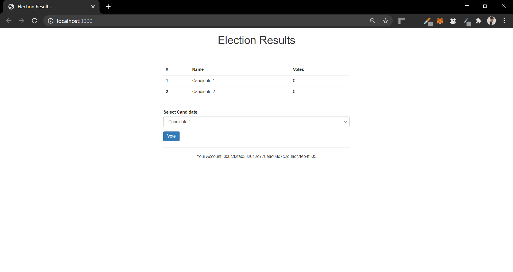
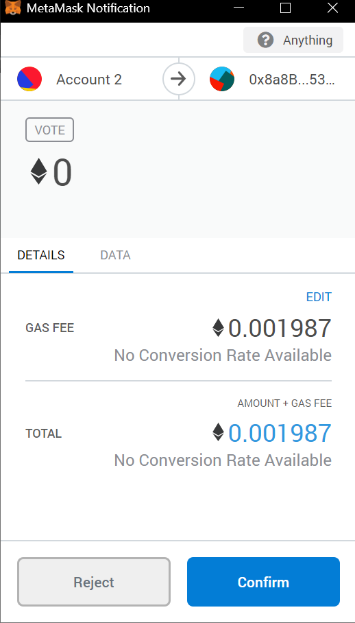
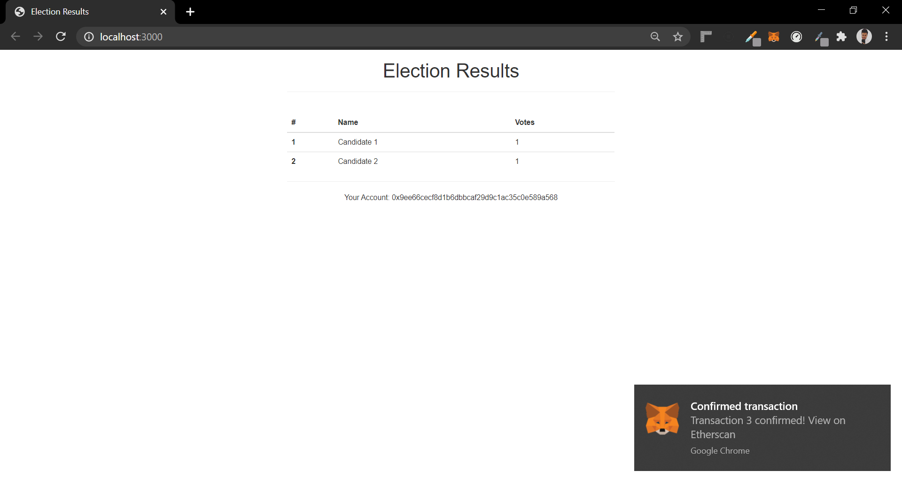

# e-voting-system-using-blockchain
A e-voting system desinged using ethereum blockchain and javascript.

# PROBLEM STATEMENT
1.We are facing a lot of problems in our day to day life for example, Democratic voting is a crucial and serious event in any country. The most common way in which a country votes is through a paper based system.But with  the use of blockchains a secure and robust system for 4 digital voting can be devised. This report outlines our idea of how blockchain technology could be used to implement a secure digital voting system. 
2.After the first point that refers to ideality of problem statement we should now see its reality so nowadays blockchain is used Blockchain has often been described as a solution in search of problem, but the technology is slowly moving out of research labs and into real-world applications to creating a growing global market that Research and Markets expects to rise from $80 million this year to more than $2.3 billion by 2023.
3.As Blockchain is helping the voting system to be digital and make it useful for us .Moreover ,Blockchain can readily be applied to real estate information and Blockchain can improve health care services. With patient health records in a blockchain environment, all the healthcare providers in a person’s network can receive permission, once verified, to access, view and update the same, single record of that person’s history. So if block chains are not used so we have to face consequences about these day to day functions .
4.For our design we tried to create a system that doesn’t entirely replace the current voting but rather integrates within a current system. We decided to do this to allow for as many different ways to vote as possible, this is so voting can be accessed by the majority of the population.

# DOMAIN KNOWLEDGE
Domain knowledge is knowledge about the environment in which the target system operates.In this we are talking about blockchain so,we should know in what fields this system works---Blockchains permit to store information in a tamper-resistant and irrevocable manner by reverting to distributed computing and cryptographic technologies. The primary purpose is to keep track of the ownership of tangible and intangible assets.

# TECHNICAL PAPERS REFERRED EXCERPTS
Blockchain-enabled e-voting (BEV) could reduce voter fraud and increase voter access. Eligible voters cast a ballot anonymously using a computer or smartphone. BEV uses an encrypted key and tamper-proof personal IDs.

E-voting is among the key public sectors that can be disrupted by blockchain technology.1 The idea in blockchain-enabled e-voting (BEV) is simple. To use a digital-currency analogy, BEV issues each voter a “wallet” containing a user credential. Each voter gets a single “coin” representing one opportunity to vote. Casting a vote transfers the voter’s coin to a candidate’s wallet. A voter can spend his or her coin only once. However, voters can change their vote before a preset deadline.

A blockchain is simply a cryptographically verifiable list of data. One of the reasons for the enthusiasm around the blockchain is that databases do not have any cryptographic guarantees of integrity, guarantees that are necessary for any database operating in an adversarial environment.

With Bitcoin and variants being developed by practitioners rather than cryptographers, the trust tends to be put not in formal proofs and properties but in practical resistance to attacks based on common knowledge and experience by practitioners

# METHODOLOGY TO IMPLEMENT E-VOTING USING BLOCKCHAIN
This method has 5 main requirements
1. AUTHENTICATION(already registered people can cast a vote)
2. ANONYMITY(voter will remain anonymous)
3. ACCURACY(every vote has to be counted)
4. VERIFIABILITY(to ensure the votes are counted)
5. FLEXIBILITY AND MOBILITY

# SIMPLE REPRESENTATION OF BLOCKCHAIN 
The first block is the foundation block which contains candidate’s name. This block will not be counted as vote . In this system a candidate may return a blank vote indicating dissatisfaction. Whenever a voter votes transaction is recorded and blockchain is updated. The block may will as well contain previous voters information to ensure security. The user’s vote is send to one of the node of the system and node adds vote to blockchain.

# REPRESENTATION OF E-VOTING
1. The voter will login to the system using his/her credentials provided by government. Our system will check the data ,if matched with a valid voter ,vote can be casted.
2. There are two options given
    (i) Vote for a candidate
    (ii) Cast a blank vote  
3. After the user casts his vote, the system will generate an input that contains the voter identification and the hash of the previous vote. This way each input will be unique and ensure that the encrypted output will be unique as well. The encrypted information will be recorded in the block header of each vote cast. It can be encrypted using SHA-256 in which reverse string cannot be generated. Therefore there is no way to retrieve voter’s information.
4.    Once the block is created the information is recorded in corresponding blockchain and gets linked with previously cast vote

# TOOLS IDENTIFIED FOR DOMAIN	
Solidity is one of the most popular languages used by Blockchain Developers. Influenced by C++, Python, and JavaScript, it was designed to target the Ethereum Virtual Machine(EVM). Solidity is statically typed, supports inheritance, libraries, and complex user-defined types.  By using Solidity a user can do the following:
  1. Mine ether tokens
  2. Transfer tokens between addresses
  3. Create smart contracts and execute it on the Ethereum Virtual Machine
  4. Explore the block history
Solidity supports the OOP paradigm and is most commonly used for writing smart contracts. With Solidity, Blockchain Developers can write applications that can execute self-enforcing business logic embodied in smart contracts, thereby leaving a non-repudiable, and authoritative record of transactions. This comes in handy for creating contracts for voting, crowdfunding, multi-signature wallets, and blind auctions.

# ARCHITECTURE

# FLOWCHART

# ADVANTAGES
Advantages of e-voting system using blockchain below:
* You can vote anytime/anywhere (During Pandemics like COVID-19 where it’s impossible to hold elections physically
* Secure
* Immutable
* Faster
* Transparent

# SCREENSHOTS

# REFERENCES
https://libres.uncg.edu/ir/uncg/f/N_Kshetri_Blockchain_Enabled_2018.pdf
https://www.researchgate.net/profile/Umut_Cabuk/publication/323318041_Towards_Secure_E-Voting_Using_Ethereum_Blockchain/links/5a931e2faca272140565c7e4/Towards-Secure-E-Voting-Using-Ethereum-Blockchain.pdf
https://skemman.is/bitstream/1946/31161/1/Research-Paper-BBEVS.pdf
http://budi.rahardjo.id/files/students/rifa/paper.pdf
https://pdfs.semanticscholar.org/7e8d/c5b93a2ff6fcb4a986e89d23add04f9ac27e.pdf
https://pdfs.semanticscholar.org/5b6a/0b0ff2c574d9bb8bad9e191b22f44c92add7.pdf

